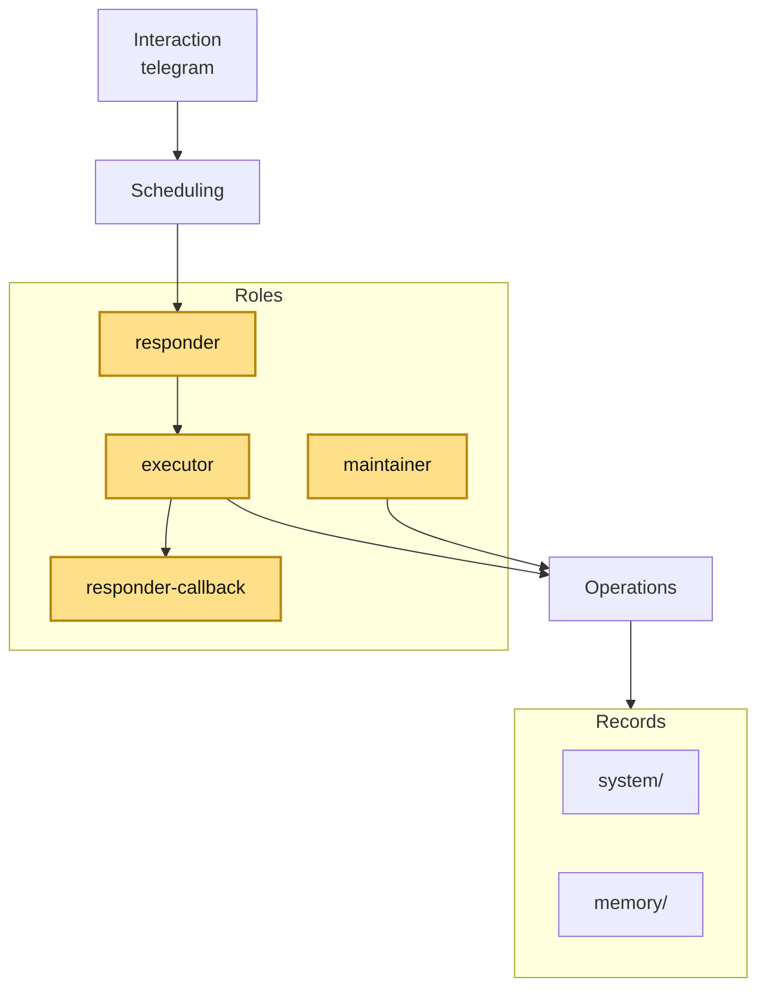

# The Defect Bot

[中文说明](README.zh-CN.md)

A local-first Telegram bot for personal memory, files, reminders, and lightweight relay workflows.

It runs through a local OpenCode server, keeps canonical state in the repository, and treats Telegram as a platform adapter rather than the center of the architecture.

## What it does

- remember and retrieve personal facts
- organize uploaded files and materials
- create and manage reminders
- send messages or reminders to authorized users or known group chats
- let the admin manage durable user roles through the bot

## Architecture

The bot is organized as a small layered system: interaction, scheduling, roles, support, operations, and records.


### Conversation scoping

Short-term conversational context is kept in OpenCode sessions by scope:

- **private chat** -> one session per user
- **group / supergroup** -> one session per chat

Long-term facts, access roles, reminders, and structured rules do **not** rely on model session history. They live in repository state such as `system/users.json`, `system/chats.json`, `system/rules.json`, and reminder data.

## Example on the architecture

Example dialogue:

- User: "Remind me tomorrow at 9am to submit the application."
- Bot: "Got it. I'll remind you tomorrow at 9:00."

```mermaid
flowchart LR
  U[User request\n"Remind me tomorrow at 9am to submit the application"] --> IT[telegram]
  IT --> SC[conversation controller]
  SC --> RS[responder]
  RS --> UA[ai gateway]
  UA --> RS
  RS --> RX[executor]
  RX --> OR[reminders]
  OR --> DS[system/]
  RX --> RC[responder-callback]
  RC --> IT
  IT --> V[User sees\n"Got it. I'll remind you tomorrow at 9:00."]
```

## Quick start

```bash
cp config.toml.example config.toml
cp .env.example .env
just install
opencode serve --port 4096
just serve
```

## Configuration

Fill in at least:

- `telegram.bot_token`
- `telegram.admin_user_id`

Typical setup:

```toml
[telegram]
bot_token = "YOUR_TELEGRAM_BOT_TOKEN"
admin_user_id = 333333333
waiting_message = "Thinking..."
waiting_message_candidates = ["Still thinking...", "Almost there..."]
waiting_message_rotation_seconds = 5
menu_page_size = 8

[bot]
language = "zh"
persona_style = "Speak like the Defect from Slay the Spire."
default_timezone = "Asia/Tokyo"

[maintenance]
enabled = true
idle_after_minutes = 15

[opencode]
base_url = "http://127.0.0.1:4096"
```

Useful optional settings:

- `telegram.menu_page_size`: Telegram inline menu page size
- `telegram.waiting_message` / `telegram.waiting_message_candidates`: Telegram waiting UI text; if `waiting_message` is empty, no waiting message is shown
- `bot.default_timezone`: fallback timezone used when the user has not explicitly provided one
- `maintenance.idle_after_minutes`: run maintenance after this many idle minutes
- `[opencode].base_url`: local OpenCode server address

## Telegram prerequisites

- Every user who should receive direct bot messages must have started a private chat with the bot at least once.
- If you want to use the bot in group chats, open **BotFather** and turn **Group Privacy** off for the bot.

## Access levels

- `allowed user`: may chat with the bot and use basic personal features
- `trusted user`: may read and modify memory, files, reminders, and other persistent data
- `admin user`: trusted user plus admin-only operations

The admin may also temporarily allow a `@username`. After that, the user only needs to interact with the bot before the temporary authorization expires so the system can link the account and grant access. This can be a private chat, an `@bot` mention in a group, or a reply to the bot in a group.

## Example usage

- “Remember my passport number.”
- “What is my home address?”
- “Remind me tomorrow at 9am to submit the application.”
- “Send this to @kyogokuame: dinner is ready.”
- “Send this to the family group.”
- “Set @someone to trusted.”

## Commands

- `/help`
- `/new`
- `/model` (trusted/admin)
