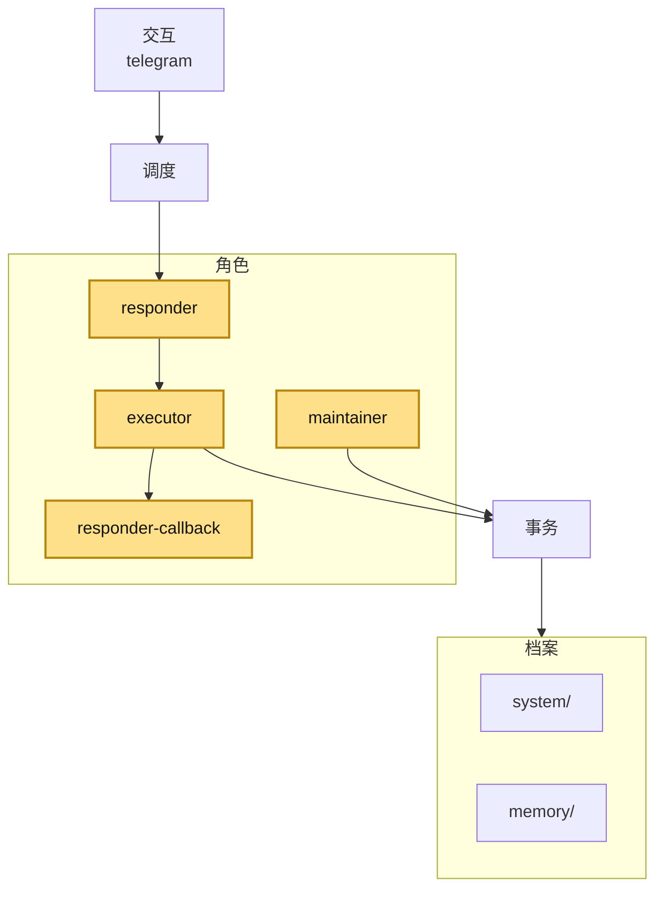

# 故障机器人

[English README](README.md)

一个本地优先的 Telegram bot，用于个人记忆、文件、提醒，以及轻量的消息转达流程。

它通过本地 OpenCode server 运行，把规范事实保存在仓库里，并把 Telegram 视为平台适配器，而不是整个系统的中心。

## 它能做什么

- 记住并查询个人事实信息
- 整理上传的文件和资料
- 创建和管理提醒
- 向已授权用户或已知群聊发送消息或提醒
- 让 admin 通过 bot 管理持久用户角色

## 架构

整体上，它是一个简洁的分层系统：交互、调度、角色、支援、事务、档案。


### 会话作用域

短期对话上下文由 OpenCode session 按作用域保存：

- **私聊** -> 每个用户一个 session
- **群 / 超级群** -> 每个群一个 session

长期事实、访问角色、提醒、结构化规则**不依赖**模型会话历史，而是保存在仓库状态中，例如：

- `system/users.json`
- `system/chats.json`
- `system/rules.json`
- reminder 相关状态

## 架构中的一个例子

对话示例：

- 用户："提醒我明天早上 9 点提交申请。"
- Bot："好，已经记下。我会在明天 9:00 提醒你。"

```mermaid
flowchart LR
  U[User request\n"提醒我明天早上 9 点提交申请"] --> IT[telegram]
  IT --> SC[conversation controller]
  SC --> RS[responder]
  RS --> UA[ai gateway]
  UA --> RS
  RS --> RX[executor]
  RX --> OR[reminders]
  OR --> DS[system/]
  RX --> RC[responder-callback]
  RC --> IT
  IT --> V[User sees\n"好，已经记下。我会在明天 9:00 提醒你。"]
```

## 快速开始

```bash
cp config.toml.example config.toml
cp .env.example .env
just install
opencode serve --port 4096
just serve
```

## 配置

至少填写：

- `telegram.bot_token`
- `telegram.admin_user_id`

典型配置：

```toml
[telegram]
bot_token = "YOUR_TELEGRAM_BOT_TOKEN"
admin_user_id = 333333333
waiting_message = "机宝启动中..."
waiting_message_candidates = ["还在想...", "再等我一下..."]
waiting_message_rotation_seconds = 5
menu_page_size = 8

[bot]
language = "zh"
persona_style = "模仿杀戮尖塔里的故障机器人说话。"
default_timezone = "Asia/Tokyo"

[maintenance]
enabled = true
idle_after_minutes = 15

[opencode]
base_url = "http://127.0.0.1:4096"
```

一些常用的可选项：

- `telegram.menu_page_size`：Telegram 内联菜单分页大小
- `telegram.waiting_message` / `telegram.waiting_message_candidates`：Telegram 等待态文案；如果 `waiting_message` 为空，就不会显示等待消息
- `bot.default_timezone`：用户未显式提供时使用的默认时区
- `maintenance.idle_after_minutes`：空闲多少分钟后触发 maintenance
- `[opencode].base_url`：本地 OpenCode server 地址

## Telegram 使用前提

- 任何需要接收 bot 私聊消息的用户，都必须先主动和 bot 私聊一次。
- 如果要在群里使用这个 bot，需要去 **BotFather** 把该 bot 的 **Group Privacy** 关闭。

## 权限级别

- `allowed user`：可以和 bot 对话并使用基础功能
- `trusted user`：可以读取和修改记忆、文件、提醒及其他持久化数据
- `admin user`：在 trusted 的基础上拥有管理权限

admin 也可以对某个 `@username` 做临时授权。之后，对方只要在临时授权过期前和 bot 发生一次可识别交互，系统就能关联该账号并授予访问权限。这可以是私聊，也可以是在群里 `@bot`，或者在群里回复 bot 的消息。

## 使用示例

- “记一下我的护照号。”
- “我的家庭住址是什么？”
- “提醒我明天早上 9 点提交申请。”
- “发给 @kyogokuame：晚饭好了。”
- “把这条消息发到家庭群。”
- “把 @someone 设为 trusted。”

## 命令

- `/help`
- `/new`
- `/model`（仅 trusted/admin）
